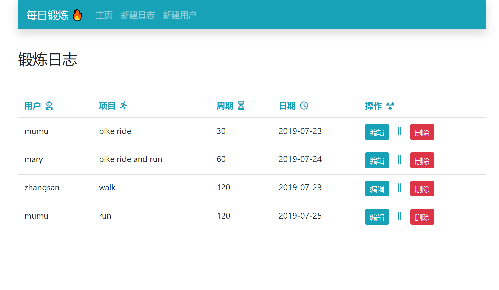

## Available Scripts

### 环境 nodejs create-react-app mongodb

项目截图：

在`backend`目录下运行命令：node server / nodemon server

在项目根目录下, 运行命令打开前端界面:

### `yarn start`

测试：

### `yarn test`

构建：

### `yarn build`

